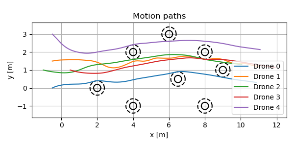
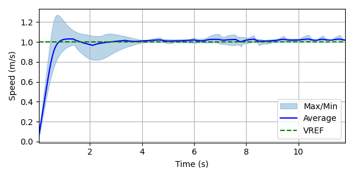
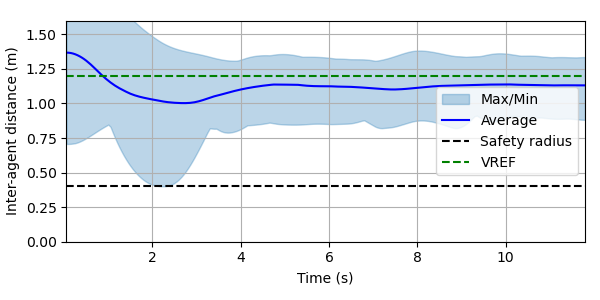
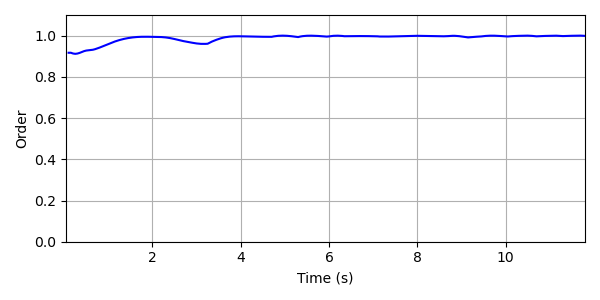

# Predictive control of aerial swarms in cluttered environments

This repository refactors the following article in Python:

E. Soria, F. Schiano, and D. Floreano, "**Predictive control of aerial swarms in cluttered environments**," *Nature Machine Intelligence*, vol. 3, pp. 545–554, 2021. [[**Nature**](https://www.nature.com/articles/s42256-021-00341-y)] [[Citation](#citation)]

## Installation
```
git@github.com:duynamrcv/predictive_swarm.git
```

## Run simulation
To setup number of Drone, number of obstacles or other configuration parameters, edit `config.py` file.
```
python3 main.py
```
The data will be saved in `*.npy` file. To view results data, please run:
```
python3 plot.py
```

## Results
| Motion paths | Speed |
| :---:        |     :---:      |
|     | <a href="results/vision_False.gif"></a>    |

| Inter-agent distance | Order metric |
| :---:        |     :---:      |
|     |     |
